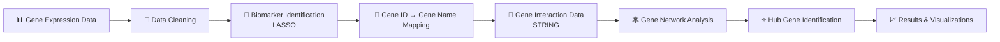
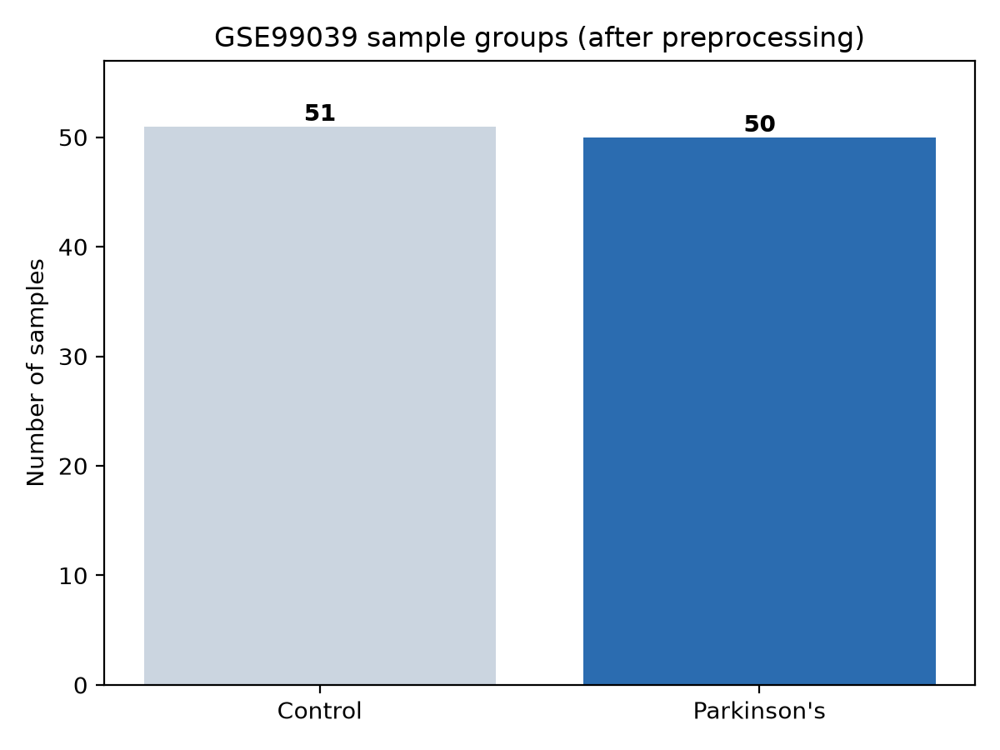
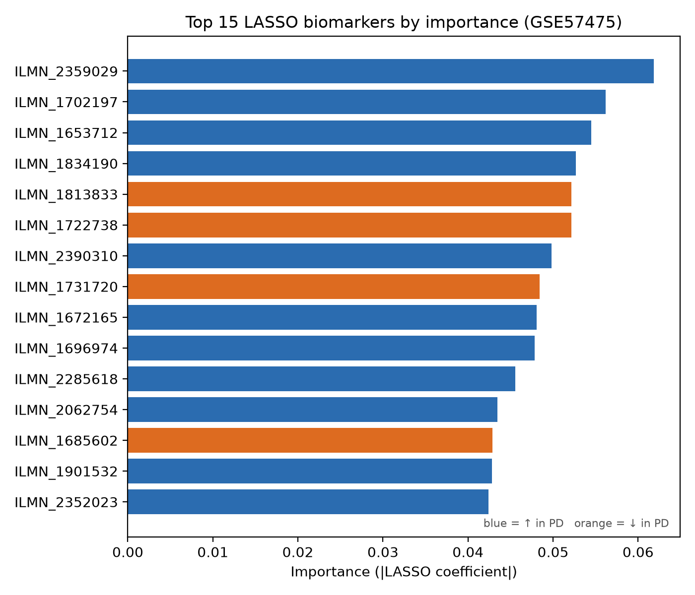
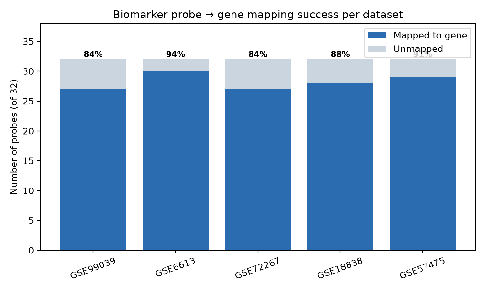
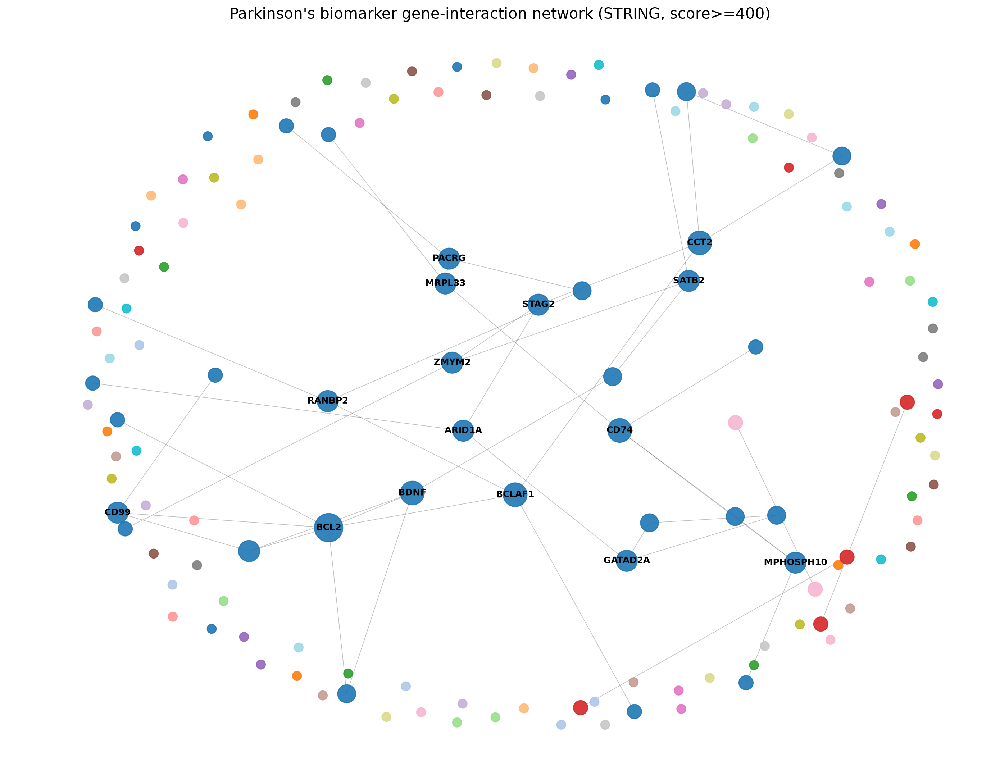
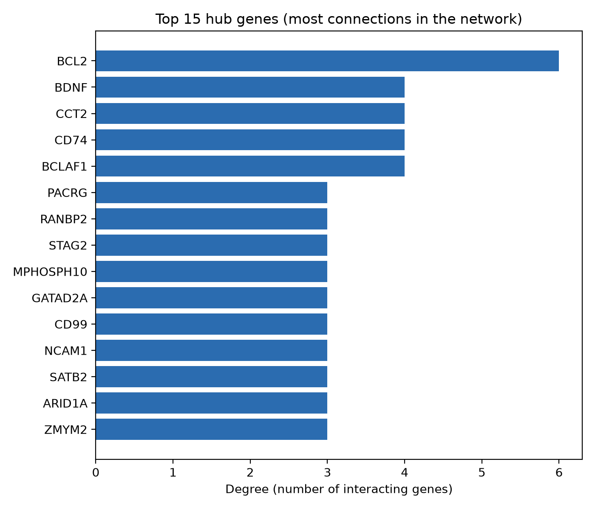
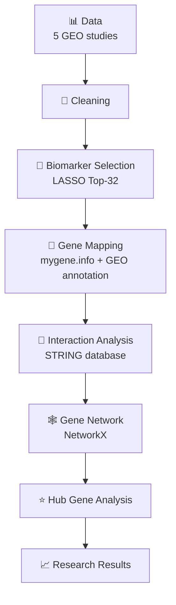

# 🧬 Reasearch_Genomic — Parkinson's Disease Biomarker & Gene-Network Study


> **In one sentence:** This project studies **gene-expression data** to find genes
> that may act as **biomarkers** for **Parkinson's disease**, converts those genes
> into readable names, and connects them into a **network** to see how they relate.

---

## 📖 1. What is this project?

Our bodies are run by **genes**. When someone has a disease, some genes become
more active and some less active. By measuring this activity across many people
(some healthy, some with Parkinson's disease), we can look for genes whose
activity pattern is linked to the disease. Those useful genes are called
**biomarkers**.

**The problem:** Parkinson's disease is hard to detect early, and the biology
behind it is complex. Researchers need help narrowing down *which* genes are
worth studying.

**What this project does:**
1. Takes real public gene-activity data from 5 patient studies.
2. Uses machine learning to pick the most informative genes (biomarkers).
3. Translates cryptic gene codes into real gene names.
4. Draws a **network** showing how those genes interact, and highlights the
   most important ("hub") genes.

**Why it matters:** Understanding how potential biomarkers relate to each other
helps researchers spot biological patterns and choose genes that deserve deeper
investigation. *(This is exploratory research — it does not diagnose, prove
causes, or suggest treatments.)*

**Final goal:** a clean, reproducible pipeline that turns raw gene data into an
interpretable gene-interaction network of Parkinson's biomarker candidates.

---

## 🔄 2. What we did (workflow)



---

## 🔬 3. What we have done (with real outputs)

### 1️⃣ Dataset & preprocessing


Gene-activity data is cleaned and organised. Example above: the GSE99039 study
has a balanced set of **51 control** and **50 Parkinson's** samples.

### 2️⃣ Biomarker identification


A machine-learning method (**LASSO**) ranks genes by how strongly their activity
separates Parkinson's from control. The top 32 per study are kept.

### 3️⃣ Gene ID → gene name mapping


The biomarkers arrive as machine codes (probe IDs). We convert them into real
gene names — **84–94% mapped** across the five studies.

### 4️⃣ Gene network


Mapped genes are linked using known biological interactions. Larger, labelled
dots are the most connected genes; small outer dots are genes with no strong
links in this set.

### 5️⃣ Hub gene analysis


Network analysis finds the **hub genes** — the most connected, potentially most
influential genes in the network.

---

## 🔁 4. Before → After

```text
BEFORE  (machine codes)             AFTER  (biology you can read)
--------------------------          --------------------------------
1554241_at                          BCL2, BDNF, PACRG, SYT11, ...
ILMN_2359029          ───────►      + real gene names
2569649                             + gene-to-gene relationships
209950_s_at                         + a gene network
                                    + ranked hub genes
```

Raw, meaningless identifiers become **readable gene names plus a map of how they
connect** — understandable without a biology or coding background.

---

## 🧠 5. Simple explanation of key terms

| Term | Simple meaning |
|------|----------------|
| **Gene** | A small piece of biological information that helps control how the body works |
| **Biomarker** | A measurable biological signal that gives useful information about a disease |
| **Gene ID** | A unique code used by machines to identify a gene (e.g. `1554241_at`) |
| **Gene symbol** | The short, readable name of a gene (e.g. `BCL2`) |
| **Gene network** | A map showing how different genes are connected |
| **Node** | One gene shown in the network |
| **Edge** | A connection (interaction) between two genes |
| **Hub gene** | A highly connected, likely important gene in the network |

---

## 💡 6. Why this matters

> Understanding relationships between potential biomarkers can help researchers
> explore biological patterns and identify genes that may deserve further
> investigation.

⚠️ **Important:** the genes found here are **research candidates only**. This
project does **not** claim they cause Parkinson's, diagnose it, or treat it.

---

## 🛠️ 7. Project pipeline (with stages)



---

## 📊 8. Research results (actual numbers)

| Metric | Result |
|--------|-------:|
| Datasets analysed | 5 |
| Biomarkers selected (per dataset) | 32 |
| Total biomarker probes | 160 |
| Unique genes successfully mapped | **139** |
| Unmapped probes (reported, not dropped) | 19 |
| Ambiguous probes (one probe → many genes) | 10 |
| Duplicate genes (many probes → one gene) | 1 |
| Network nodes (genes) | **139** |
| Network edges (interactions) | **44** |
| Connected components | 102 |
| Largest connected component | 35 genes |

**Mapping success per dataset**

| Dataset | Platform | Mapped | % |
|---------|----------|:------:|:---:|
| GSE99039 | GPL570 | 27/32 | 84% |
| GSE6613 | GPL96 | 30/32 | 94% |
| GSE72267 | GPL571 | 27/32 | 84% |
| GSE18838 | GPL5175 | 28/32 | 88% |
| GSE57475 | GPL6947 | 29/32 | 91% |

**Top hub genes:** `BCL2`, `BCLAF1`, `CCT2`, `CD74`, `BDNF`.
Known Parkinson's-associated genes **`PACRG`** and **`SYT11`** appear in the main
connected component.

---

## 📁 9. Project structure

```text
📁 data/        → The datasets (raw, cleaned, and cached lookups)
📁 src/         → The main analysis code
📁 scripts/     → One-command runners for each stage
📁 notebooks/   → Step-by-step research experiments
📁 results/     → Tables, graphs and final outputs
📁 docs/        → Extra documentation (methodology)
📁 tests/       → Automatic checks that the code works
```

<details>
<summary>🔧 Full folder tree (for developers)</summary>

```text
Reasearch_Genomic/
├── data/{raw,processed,external}/
├── src/{config.py,preprocessing,biomarker_mapping,network_analysis,utils}/
├── scripts/{run_biomarker_mapping.py,run_network_analysis.py,make_figures.py}
├── notebooks/{preprocessing,biomarker_analysis,network_analysis}/
├── results/{biomarker_selection,biomarker_mapping,network,figures,models,tables}/
├── docs/methodology.md
├── tests/test_pipeline.py
├── requirements.txt
└── README.md
```
</details>

---

## ▶️ 10. How to run

**Step 0 — get the project and its tools** (assumes Python 3.10+ installed):

```bash
git clone <repository-url>
cd Reasearch_Genomic
pip install -r requirements.txt
```

**Step 1 — map biomarkers to gene names:**

```bash
python -m scripts.run_biomarker_mapping
```

**Step 2 — build and analyse the gene network:**

```bash
python -m scripts.run_network_analysis
```

**Step 3 (optional) — regenerate the README figures:**

```bash
python -m scripts.make_figures
```

**Check everything works:**

```bash
python tests/test_pipeline.py
```

> 💡 The first run downloads gene information from the internet and saves it in
> `data/external/`. After that, the project runs offline and gives identical
> results.

---

## 📸 11. Results gallery

| Preprocessing | Biomarkers | Gene mapping |
|:---:|:---:|:---:|
|  |  |  |
| **Sample groups** | **Top LASSO biomarkers** | **Mapping success** |

| Gene network | Hub genes |
|:---:|:---:|
|  |  |
| **Full interaction network** | **Most connected genes** |

---

## 📚 12. Dataset information

Five public **NCBI GEO** Parkinson's gene-expression studies:

| Dataset | Platform | Technology |
|---------|----------|-----------|
| GSE99039 | GPL570 | Affymetrix HG-U133 Plus 2.0 |
| GSE6613 | GPL96 | Affymetrix HG-U133A |
| GSE72267 | GPL571 | Affymetrix HG-U133A 2.0 |
| GSE18838 | GPL5175 | Affymetrix Human Exon 1.0 ST |
| GSE57475 | GPL6947 | Illumina HumanHT-12 V3.0 |

**Data & tool sources**
- Gene expression: [NCBI GEO](https://www.ncbi.nlm.nih.gov/geo/)
- Probe → gene mapping: [mygene.info](https://mygene.info) (+ GEO platform annotation fallback for Illumina)
- Gene interactions: [STRING database](https://string-db.org) v12

---

## 🔬 13. Methodology (short)

1. **Preprocess:** load GEO series matrix → samples × genes → standardize.
2. **Select biomarkers:** L1 logistic regression (**LASSO**) → top 32 genes by importance.
3. **Map genes:** resolve probe IDs to gene symbols via mygene.info; fall back to
   GEO platform annotation for Illumina IDs; report unmapped/ambiguous/duplicates.
4. **Build network:** query STRING for interactions (confidence ≥ 400), build a
   NetworkX graph, compute degree/centrality, hubs, and components.
5. **Visualize:** network plot + summary figures.

Full details: [`docs/methodology.md`](docs/methodology.md).

---

## ⚠️ 14. Limitations

- Gene candidates are **exploratory** — not proven diagnostic or causal markers.
- Mapping depends on public databases; exact results are pinned via cached files
  in `data/external/`.
- The network is **sparse** (many unconnected genes) because biomarkers come from
  five different platforms/cohorts and aren't expected to be densely linked at
  medium confidence.
- STRING edges are **functional associations**, not proven physical interactions.
- A few probes (especially Exon-array and immunoglobulin/snoRNA clusters) map
  ambiguously or not at all — these are reported, never silently dropped.

---

## 🚀 15. Future work

- Cross-dataset biomarker overlap and consensus gene ranking.
- Pathway / gene-ontology enrichment of hub genes.
- Lower STRING confidence threshold + community detection for denser modules.
- Validate candidate biomarkers on an independent PD cohort.

---

## 📝 16. Citation / references

- Szklarczyk D. *et al.* **STRING v12**, *Nucleic Acids Research*, 2023.
- Wu C. *et al.* **BioGPS / mygene.info**, *Nucleic Acids Research*.
- Source expression data: NCBI GEO accessions GSE99039, GSE6613, GSE72267,
  GSE18838, GSE57475.

*If you use this project, please cite the original GEO datasets and the STRING /
mygene.info resources above.*
